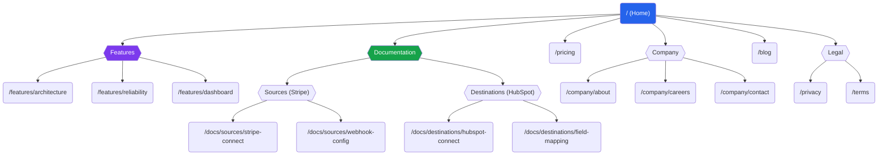

# Omniroo Marketing Website

Static marketing site built with Hugo. This repository contains all content and configuration for the public-facing website.

## Sitemap Structure

```mermaid
flowchart TD
    Home("/ (Home)") --> Features{{Features}}
    Home --> Docs{{Documentation}}
    Home --> Pricing("/pricing")
    Home --> Company{{Company}}
    Home --> Blog("/blog")
    Home --> Legal{{Legal}}

    Features --> Architecture("/features/architecture")
    Features --> Reliability("/features/reliability")
    Features --> Dashboard("/features/dashboard")

    Docs --> Sources{{"Sources (Stripe)"}}
    Docs --> Destinations{{"Destinations (HubSpot)"}}
    
    Sources --> StripeConnect("/docs/sources/stripe-connect")
    Sources --> StripeWebhook("/docs/sources/webhook-config")
    
    Destinations --> HubSpotConnect("/docs/destinations/hubspot-connect")
    Destinations --> FieldMapping("/docs/destinations/field-mapping")

    Company --> About("/company/about")
    Company --> Careers("/company/careers")
    Company --> Contact("/company/contact")

    Legal --> Privacy("/privacy")
    Legal --> Terms("/terms")

    style Home fill:#2563eb,color:white
    style Features fill:#7c3aed,color:white
    style Docs fill:#16a34a,color:white
```
